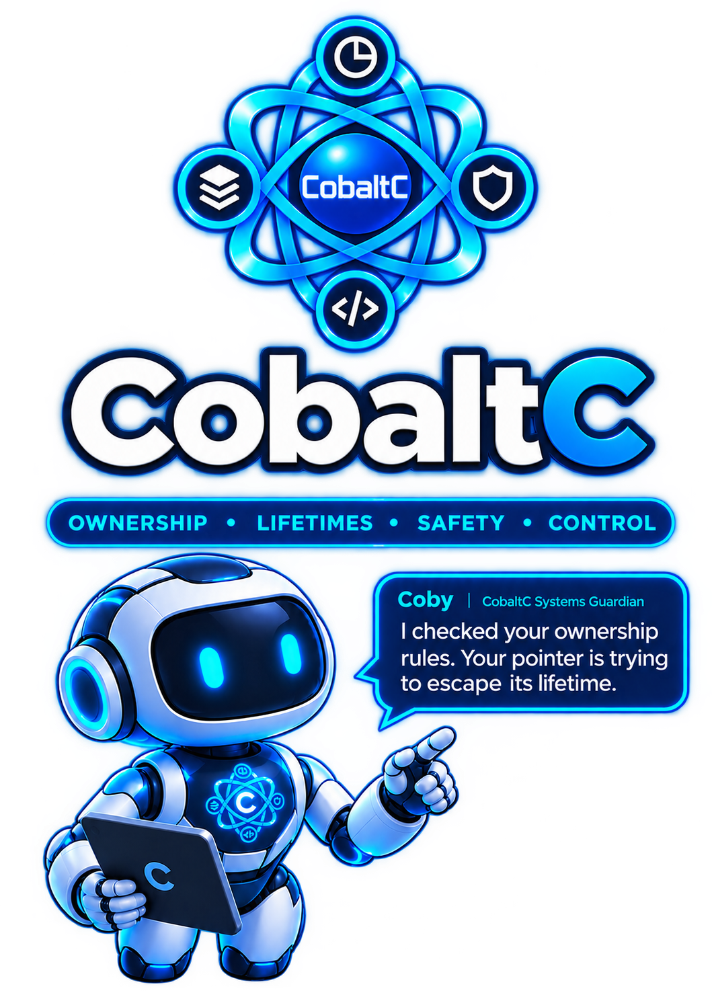

This is the home of CobaltC.

CobaltC is a statically typed systems programming language providing explicit ownership, deterministic destruction, compiler-checked borrowing, inferred lifetimes, explicit nullability, bounds-safe operations, structured error handling, safe concurrency, explicit unsafe operations, and explicit foreign-function interfaces.

The language is intended for software requiring predictable resource management, strong memory safety, native execution, and controlled interaction with low-level facilities.

Refer to the [specification](https://raw.githubusercontent.com/strawberry9/cobaltc/main/CobaltC_Specification_1.0.1_Final_Publication_V3.pdf) for more details.
