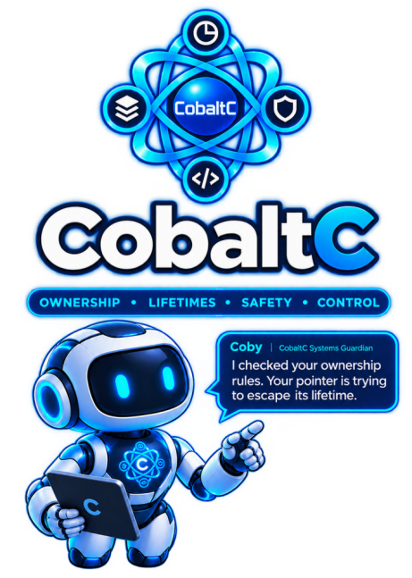

This is the offical home of the CobaltC 1.0 Language Specification.

CobaltC is a statically typed systems programming language providing explicit ownership, deterministic destruction, compiler-checked borrowing, inferred lifetimes, explicit nullability, bounds-safe operations, structured error handling, safe concurrency, explicit unsafe operations, and explicit foreign-function interfaces.

The language is intended for software requiring predictable resource management, strong memory safety, native execution, and controlled interaction with low-level facilities.

The specifiction is also available [here - ](https://strawberry9.github.io/the-wrong-memory/Appendix_06.html)
